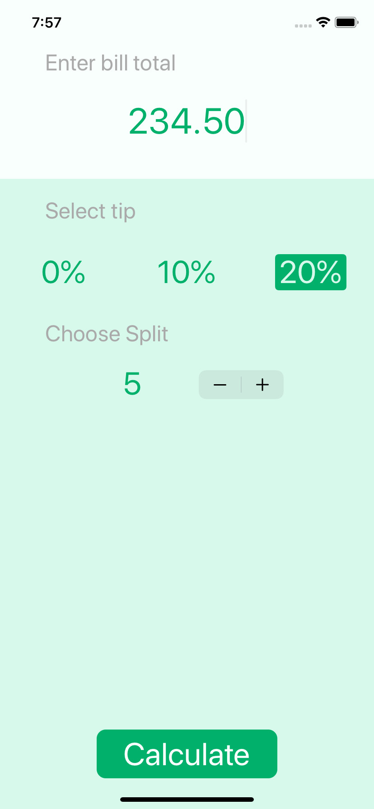
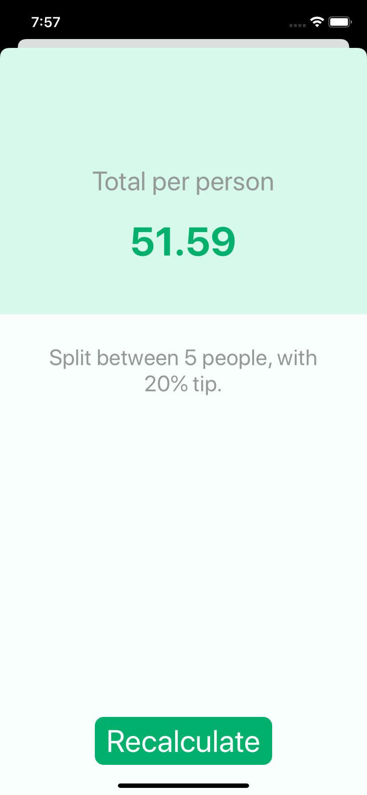

# Tip Splitter

### It will take the bill total, tip percentage and the count and it will calcualte the amount for each person.

### credits: https://www.yazanalmatar.com

## Getting Started :smiley:

- \$ git clone https://github.com/YazanAlmatar99/TipSplitter.git
- \$ cd BMI-Calculator-
- \$ open BMI Tipsy.xcodeproj

## Requirements

- Swift 5
- IOS 13

